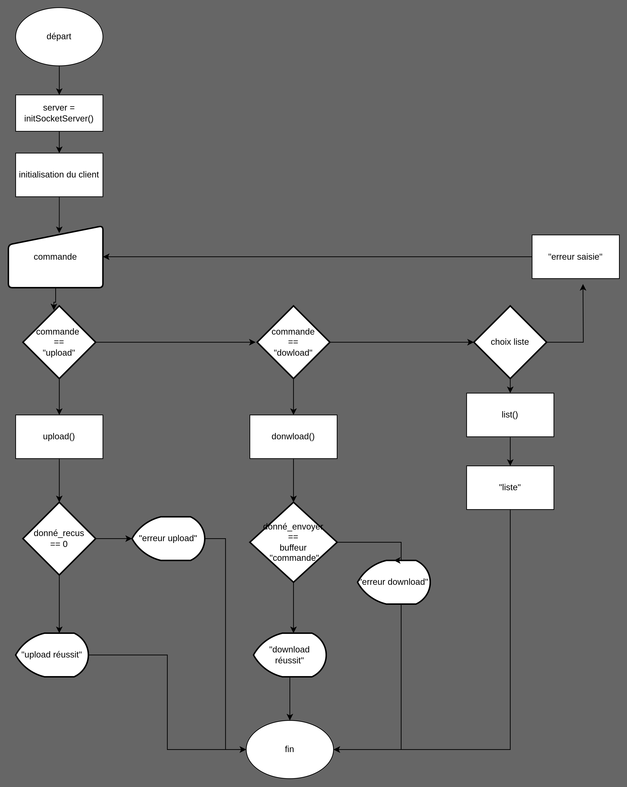
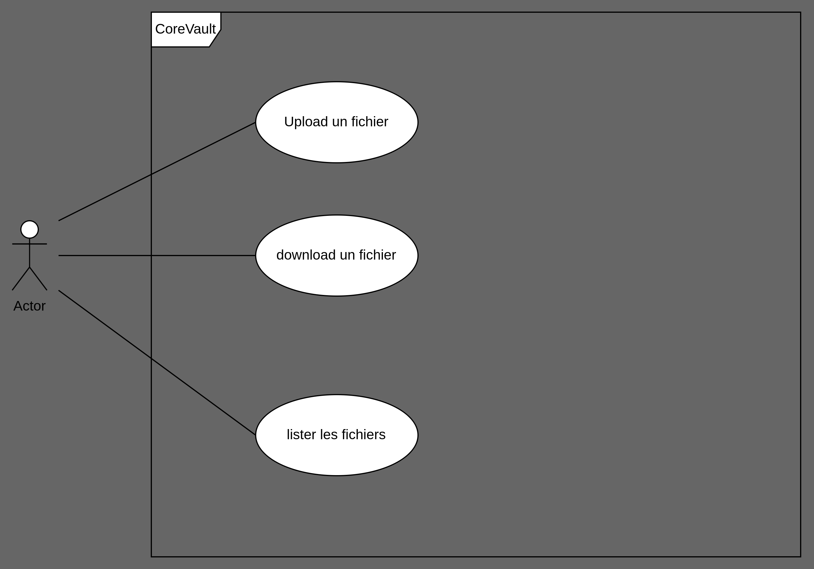

# CoreVault
CoreVault est un serveur de stockage en ligne coder dans le cadre d'un projet encadré par LaPlatforme.io

Comment on s'en sert (use case)
De quoi c'est fait (stack)

Comment ça marche
Logiramme client
logiramme server
Algorigrammes des fonctions de mon programme
Algorigrame de la fonction main
Algorigramme du thread de reception
Algorigramme du thread d'acceptation de client
Algorigramme du thread nanani
